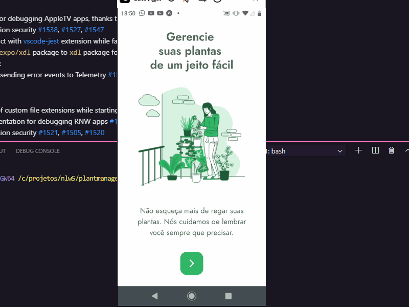

## Plantmanager mobile app

## Demo 📸

  

## Sobre o Projeto / About this project

Aplicativo para cadastrar as plantas de sua casa e receber lembretes e notificações diárias ou semanais para rega-las de acordo com a espécie da planta.

---

App to register and manage the indoor plants and receiving daily or weekly notifications remembering to water them according of the species.

### 🛠 Tecnologias / Technologies
 - [Expo] Android and IOS emulator (https://expo.io/)
 - [React] JavaScript framework (https://pt-br.reactjs.org/)
 - [React-native] React framework to mobile apps Android/IOS (https://reactnative.dev/)
 - [TypeScript] Typed JavaScript at any scale (https://www.typescriptlang.org/)

--
Getting started with the mobile app:
https://github.com/deivisutp/plantmanager-react-native

Expo install
npm install expo-cli --global

Json-Server install
npm install -g json-server

Run the JSON-SERVER :
json-server --p 3333 --H 192.168.1.7 server.json

Move yourself to the project folder and execute yarn to download the dependencies;
Run expo start to start the mobile application and open the expo on your smartphone 
with the qrcode.
